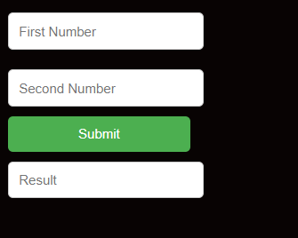

## Introduction to Dom

The Dom(Document Object Model) Api is a programming interface for web documents. It represents the page so that programs can change the document structure, style and content.The Dom represents the documents as a tree of objects; each object represents a partof the page.

## Understanding Document

In JavaScript, the Document refers to the root object of the DOM.
The DOM (Document Object Model) API is a programming interface for web documents. It represents the page so that programs can change the document structure, style, and content. The DOM represents the document as a tree of objects; each object represents a part of the page.

The document object provides an entry point to the DOM, and it represents the entire HTML or XML document. Developers can use methods and properties provided by the document object to interact with and manipulate the content of a web page dynamically.

## Manipulating HTML with JS

The DOM (Document Object Model) allows JavaScript to manipulate the HTML of a web page.

Imagine the DOM as a tree-like structure that represents your HTML document. Each element in your HTML, like buttons, paragraphs, and images, is a part of this tree. JavaScript can interact with this tree, changing, adding, or removing elements. It's like giving JavaScript the power to update what you see on a webpage.

Code Example:
Let's create a simple button that, when clicked, changes the content of a paragraph:
In this example:

```html copy
<!DOCTYPE html>
<head>
    <title>Dom</title>
    <script src="main.js"></script>
    <link rel="stylesheet" href="style.css">
</head>
<body>
    <div>
        <input type="text" placeholder="First Number" id="firstNumber"><br>
        <input type="text" placeholder="Second Number" id="secondNumber"><br>
        <input type="submit" onclick="addNumber()"><br>
        <input type="text" id="result" placeholder="Result">
    </div>
</body>
</html>

```

```jsx copy
function addNumber() {
  const firstNumber = document.getElementById("firstNumber").value;
  const secondNumber = document.getElementById("secondNumber").value;
  const additionOfNumber = parseInt(firstNumber) + parseInt(secondNumber);
  document.getElementById("result").value = additionOfNumber;
}
```

We have an HTML file with a button (simpleButton) and an empty paragraph (output).



JavaScript code at the bottom gets references to these elements using document.getElementById.
An event listener is added to the button. When clicked, the event listener function is triggered.
Inside the function, we use textContent to change the content of the paragraph, making something appear on the page.

When you open this HTML file in a browser, clicking the button will make the paragraph magically display a message. This showcases how the DOM allows JavaScript to interact with and modify the content of a web page dynamically.

## Classes vs. IDs in HTML

This is a guide to using classes and IDs in HTML.

**Classes**

- Used to group multiple HTML elements together.
- Syntax (HTML): `<element class="class-name">Content</element>`
- Syntax (CSS): `.class-name { /* styles */ }`
- Usage: Can be shared by multiple elements; an element can have multiple classes.

**IDs**

- Used to uniquely identify a specific HTML element.
- Syntax (HTML): `<element id="unique-id">Content</element>`
- Syntax (CSS): `#unique-id { /* styles */ }`
- Usage: Must be unique within a page; often used for styling or JavaScript interaction.

**Differences**

| Feature     | Classes                                                               | IDs                                                                  |
| ----------- | --------------------------------------------------------------------- | -------------------------------------------------------------------- |
| Uniqueness  | Can be shared; multiple elements can have the same class.             | Must be unique within a page; no two elements can have the same ID.  |
| Application | Used for styling multiple elements that share common characteristics. | Used for styling a specific element or targeting it with JavaScript. |

**In short, classes group elements, allowing shared styles, while IDs uniquely identify elements, often for specific styling or JavaScript interactions.**

Here is an example of how to use classes and IDs in HTML:

```html
<p class="intro">This is an introductory paragraph.</p>
<p id="special-paragraph">This is a special paragraph.</p>

<style>
  .intro {
    font-weight: bold;
  }

  #special-paragraph {
    color: red;
  }
</style>

In this example, the `.intro` class is applied to both `
<p>
  ` elements, so they will both be bold. The `#special-paragraph` ID is applied
  to the second `
</p>
<p>` element, so it will be both bold and red.</p>
```

### Methods to Select Elements

1. querySelector():
   Definition: querySelector() is a method that selects the first element that matches a specified CSS selector.
   Syntax: document.querySelector('selector')
   Example:
   In this example, querySelector('#example') selects the element with the ID "example," and the text color is changed to blue.

2. getElementById():
   Definition: getElementById() is a method that selects a single element by its ID attribute.
   Syntax: document.getElementById('id')
   Example:
   In this example, getElementById('example') selects the element with the ID "example," and the text color is changed to red.

3. getElementsByClassName():
   Definition: getElementsByClassName() is a method that selects all elements with a specific class name.
   Syntax: document.getElementsByClassName('class')
   Example:
   In this example, getElementsByClassName('highlight') selects all elements with the class "highlight," and their font weight is changed to bold.

Relationship:
All three methods are used to select and manipulate HTML elements.
getElementById() is specifically for selecting by ID.
getElementsByClassName() selects by class name, but it returns a collection of elements.
querySelector() is more flexible as it can select by any valid CSS selector and returns the first matching element.

Example Using All Three:

In this example, all three methods are used to select elements by ID, class name, and a general CSS selector, respectively. Each selected element is then styled accordingly.

### Try to implement Javascript code through backend (express) so we can learn the concept of debouncing and throttling vs Rate Limiting
